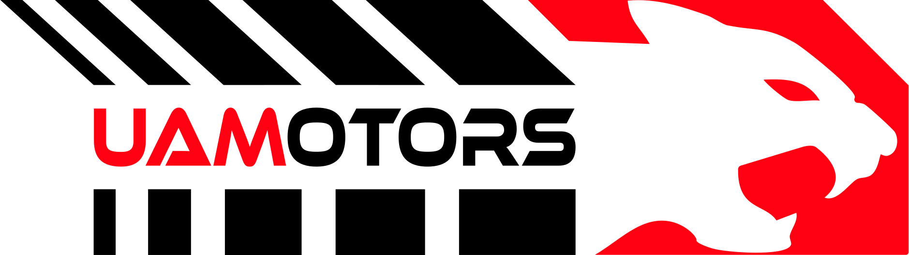

# UAMOTORS | Formula SAE - UAM

**UAMOTORS** es el equipo oficial de Formula SAE de la **Universidad Autónoma Metropolitana**, fundado en la Unidad Azcapotzalco. 
Nuestro objetivo es llevar la ingeniería mexicana al límite, a través del diseño, manufactura y validación de un vehículo tipo Fórmula para competir a nivel internacional.

## Sobre el Proyecto (OP01)
El proyecto **OP01** es el resultado de un ciclo completo de ingeniería. Desarrollamos un monoplaza fiable, enfocado en bajo costo, manufacturabilidad y el uso de simulación y diseño basado en datos.

## Licencia
El código fuente base de este sitio está basado en la plantilla "Space Ahead" y se rige bajo la licencia [GNU GPL v3](/LICENSE).

**Aviso de Propiedad Intelectual:**
A pesar de la licencia del código fuente, el contenido textual, las imágenes, logotipos (incluyendo la identidad de UAMOTORS y de la UAM) y el material del equipo presentes en este repositorio son propiedad intelectual exclusiva de **UAMOTORS**, y no pueden ser redistribuidos ni utilizados comercialmente por terceros sin autorización explícita.